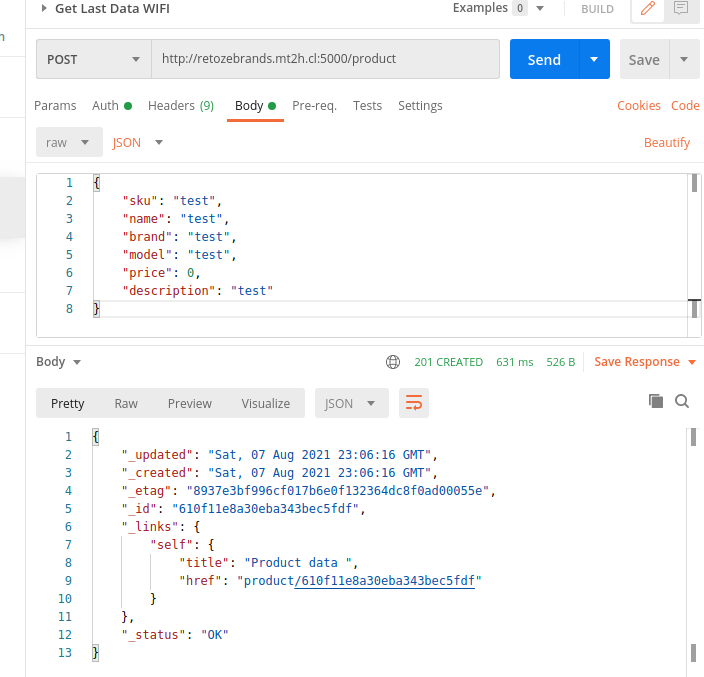
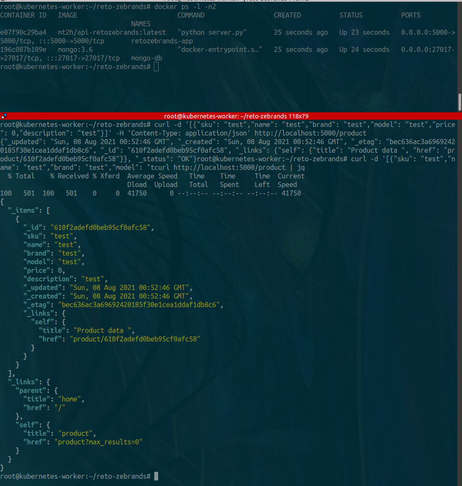

# reto-zebrands

## API REST

API REST used for this project is Eve Framework developed from python

Link: https://docs.python-eve.org/en/stable/

## Note

For this project I created a VPS in my personal domain<br/>
The VPS for check tests is: **retozebrands.mt2h.cl**<br/>
All content for tests is inside in this VPS 

## Test from the start reto 

### Test simple API REST in Python

```bash
#this test is without the database configuration 

python3 server.py
```



### Test simple API REST in Docker

```bash
#this test in Docker without the database configuration

docker build -t retozebrands .

docker run --name retozebrands-app -p 5000:5000 retozebrands

curl http://retozebrands.mt2h.cl:5000 | jq
```

### Test API REST in Docker-Compose with MongoDB Database

Initial testing

```bash
docker-compose up -d

curl -d '[{"sku": "test","name": "test","brand": "test","model": "test","price": 0,"description": "test"}]' -H 'Content-Type: application/json' http://retozebrands.mt2h.cl:5000/product

curl http://retozebrands.mt2h.cl:5000/product | jq
```

Container API whit configuration database works<br/>
Image Container Push to Personal Account DockerHub

```bash
docker build -t retozebrands .
docker tag retozebrands mt2h/api-retozebrands:latest
docker push mt2h/api-retozebrands:latest
```

Example in action

