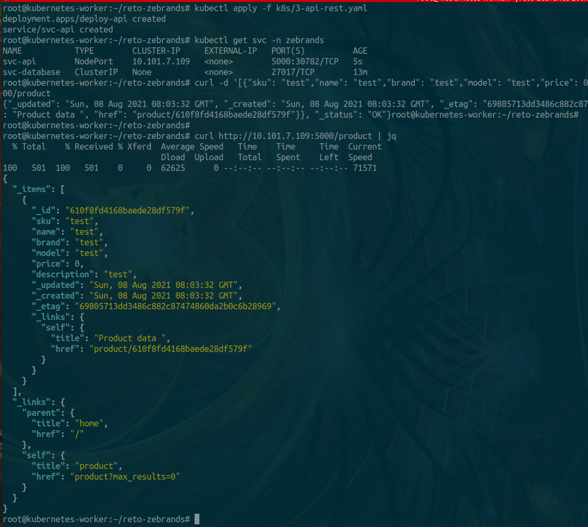

# reto-zebrands

## API REST

API REST used for this project is Eve Framework developed from python

Link: https://docs.python-eve.org/en/stable/

## Note

For this project I created a VPS in my personal domain<br/>
The VPS for check tests is: **retozebrands.mt2h.cl**<br/>
All content for tests is inside in this VPS 

## Test from the start reto 

### Test simple API REST in Python

```bash
#this test is without the database configuration 

python3 server.py
```


### Test simple API REST in Docker

```bash
#this test in Docker without the database configuration

docker build -t retozebrands .

docker run --name retozebrands-app -p 5000:5000 retozebrands

curl http://retozebrands.mt2h.cl:5000 | jq
```

### Test API REST in Docker-Compose with MongoDB Database

Initial testing

```bash
docker-compose up -d

curl -d '[{"sku": "test","name": "test","brand": "test","model": "test","price": 0,"description": "test"}]' -H 'Content-Type: application/json' http://retozebrands.mt2h.cl:5000/product

curl http://retozebrands.mt2h.cl:5000/product | jq
```

Container API whit configuration database works<br/>
Image Container Push to Personal Account DockerHub

```bash
docker build -t retozebrands .
docker tag retozebrands mt2h/api-retozebrands:latest
docker push mt2h/api-retozebrands:latest
```

Example in action


### Test API REST in Cluster Minikube of Kubernetes

there are 3 files that must be executed in order in **k8s folder**:

- Repository:
	+ k8s:
		- 1-namespace.yaml: set namespace project, the name is: ""zebrands"
		- 2-database.yaml: set service database with persistent volume

```bash
#Step 1
kubectl apply -f k8s/1-namespace.yaml

#Step 2
kubectl apply -f k8s/2-database.yaml

#Step 3
kubectl ´apply -f k8s/3-api-rest.yaml

```

Example in action



### Test API REST in Cluster Minikube of Terraform for AWS

there are some files in this directory called **terraform**:

- Repository:
	+ terraform:
		- variables.tf: set variables for resources
		- provider.tf: set provider and region in AWS"
		- vpc.tf: create VPC section: VPC, Subnet, Gateway, Route Table and Associations
		- ec2.tf: create EC2 section: SSH Key for instance, Simple Security Group and Instance on Ubuntu 20.04 LTS
		- ssh-key-reto.pem*: private and public key for instance

```bash
#Set provider and dependencies for Terraform
Terraform init

#View resources to create
terraform plan

#Create all resources in my personal account AWS
terraform apply -auto-approve

```
