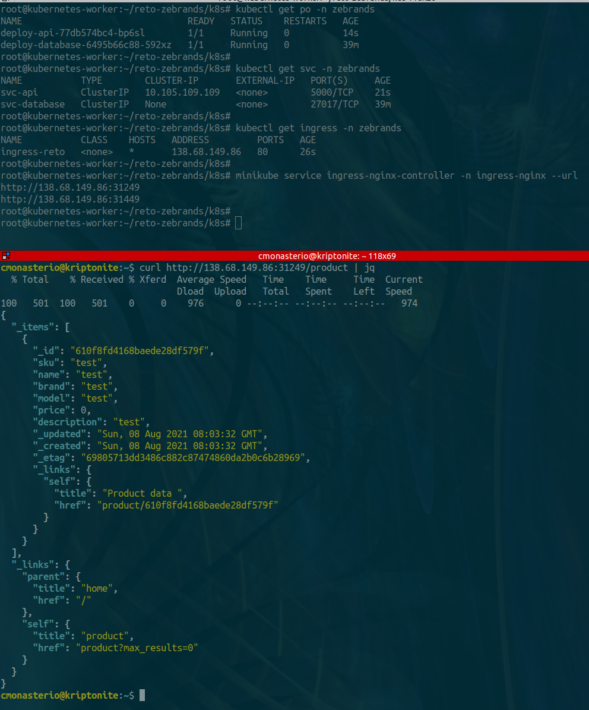

# reto-zebrands

## API REST

API REST used for this project is Eve Framework developed from python

Link: https://docs.python-eve.org/en/stable/

## Note

For this project I created a VPS in my personal domain<br/>
The VPS for check tests is: **retozebrands.mt2h.cl**<br/>
All content for tests is inside in this VPS.


The instance in EC2 AWS created after run command "apply" in terraform is **http://ec2-3-144-95-221.us-east-2.compute.amazonaws.com**<br />
In this instance AWS there is the API REST running in a minikube cluster of Kubernetes<br />
The minikube cluster is installed in the same instance AWS (on-premise)<br />
The minikube cluster is installed when creating the instance with terraform 

## How to see the API application running 

The API structure is in JSON.<br /> 

see the following link: http://ec2-3-144-95-221.us-east-2.compute.amazonaws.com:30683/product
<br /><br />
_Recommended: view it with firefox, this because firefox shows nice structure of JSON_
<br ><br >
can also be seen with curl 

```bash
curl http://ec2-3-144-95-221.us-east-2.compute.amazonaws.com:30683/product?pretty
```

the link shows all product data (currently there is only one)

## Test for insert a new data to API application

you need to send the data structure in JSON.
<br />
the following example is with a command in curl 

```bash
curl -d '[{"sku": "new_test","name": "new_test","brand": "new_test","model": "new_test","price": 0,"description": "new_test"}]' -H 'Content-Type: application/json' http://ec2-3-144-95-221.us-east-2.compute.amazonaws.com:30683/product

#then you can check the new record list of all data 
curl http://ec2-3-144-95-221.us-east-2.compute.amazonaws.com:30683/product?pretty
```

<br />
Next, the step by step of how the project was created
<br />


## Test from the start reto 

### Test simple API REST in Python

```bash
#this test is without the database configuration 

python3 server.py
```


### Test simple API REST in Docker

```bash
#this test in Docker without the database configuration

docker build -t retozebrands .

docker run --name retozebrands-app -p 5000:5000 retozebrands

curl http://retozebrands.mt2h.cl:5000 | jq
```

### Test API REST in Docker-Compose with MongoDB Database

Initial testing

```bash
docker-compose up -d

curl -d '[{"sku": "test","name": "test","brand": "test","model": "test","price": 0,"description": "test"}]' -H 'Content-Type: application/json' http://retozebrands.mt2h.cl:5000/product

curl http://retozebrands.mt2h.cl:5000/product | jq
```

Container API whit configuration database works<br/>
Image Container Push to Personal Account DockerHub

```bash
docker build -t retozebrands .
docker tag retozebrands mt2h/api-retozebrands:latest
docker push mt2h/api-retozebrands:latest
```

Example in action


### Test API REST in Cluster Minikube of Kubernetes

there are 4 files that must be executed in order in **k8s folder**:

- Repository:
	+ k8s:
		- 1-namespace.yaml: set namespace project, the name is: ""zebrands"
		- 2-database.yaml: set service database with persistent volume
 		- 3-api-rest.yaml: set API REST depends of database
 		- 4-ingress-rules.yaml: Rules Load Balancer with Nginx Rules

```bash
#Step 1
kubectl apply -f k8s/1-namespace.yaml

#Step 2
kubectl apply -f k8s/2-database.yaml

#Step 3
kubectl apply -f k8s/3-api-rest.yaml

#Step 4

#Install Ingress Nginx Controller
kubectl apply -f https://raw.githubusercontent.com/kubernetes/ingress-nginx/controller-v0.45.0/deploy/static/provider/baremetal/deploy.yaml

#apply rules
kubectl apply -f k8s/4-ingress-rules.yaml

```

Example in action



### Test API REST in Cluster Minikube of Terraform for AWS

there are some files in this directory called **terraform**:

- Repository:
	+ terraform:
		- variables.tf: set variables for resources
		- provider.tf: set provider and region in AWS"
		- vpc.tf: create VPC section: VPC, Subnet, Gateway, Route Table and Associations
		- ec2.tf: create EC2 section: SSH Key for instance, Simple Security Group and Instance on Ubuntu 20.04 LTS
		- ssh-key-reto.pem*: private and public key for instance

```bash
#Set provider and dependencies for Terraform
Terraform init

#View resources to create
terraform plan

#Create all resources in my personal account AWS
terraform apply -auto-approve

```

Example in action

Instance created after run terraform apply


Api Run in Instance AWS


View in Firefox Browser as JSON


Struct resources created in AWS with Terraform

